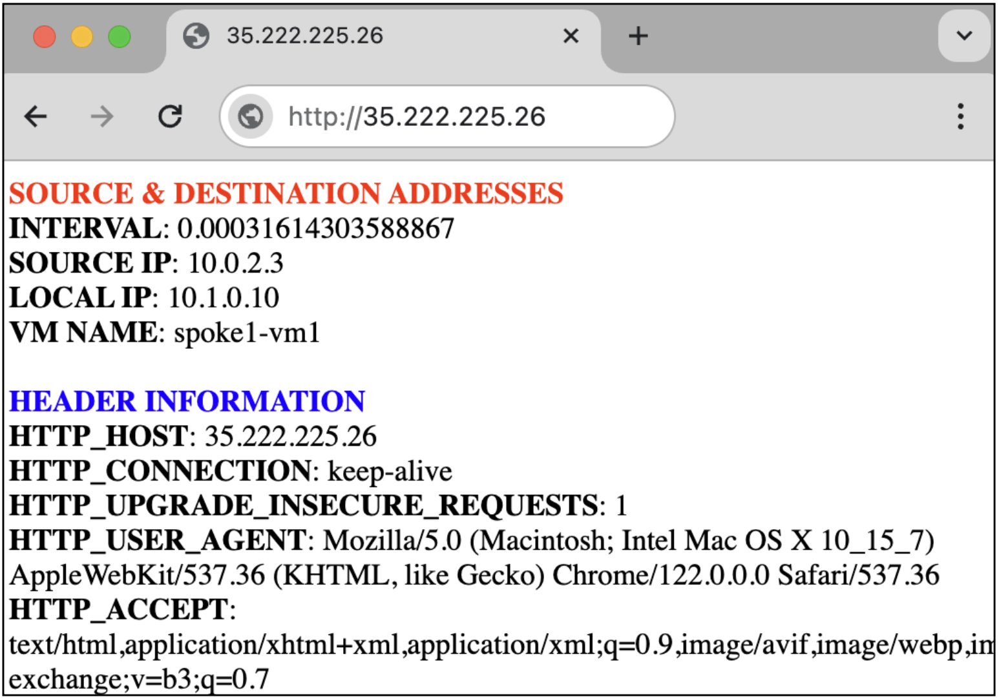

# Secure Google Cloud Hub-and-Spoke with VM-Series

This tutorial shows how to deploy and scale Palo Alto Networks VM-Series Next Generation Firewall with Terraform to secure a hub and spoke architecture in Google Cloud.  The VM-Series enables enterprises to secure their applications, users, and data deployed across Google Cloud and other virtualization environments.  

This tutorial is intended for network administrators, solution architects, and security professionals who are familiar with [Compute Engine](https://cloud.google.com/compute) and [Virtual Private Cloud (VPC) networking](https://cloud.google.com/vpc).


## Architecture

Below is a diagram of the tutorial.  VM-Series firewalls are deployed with a regional managed instance group to secure north/south and east/west traffic for two spoke VPC networks.  


| Traffic Pattern        | Description                                                                                                                                                                                                                                                                                                       |
| ---------------------- | ----------------------------------------------------------------------------------------------------------------------------------------------------------------------------------------------------------------------------------------------------------------------------------------------------------------- |
| Internet inbound       | Traffic from the internet to apps hosted in the spoke VPCs is distributed by the External Load Balancer to the VM-Series untrust interfaces (`NIC0`). The VM-Series translates the traffic through its trust interface (`NIC2`) to the spoke network. |
| Internet outbound      | Traffic from the spoke VPCs to the internet is routed to the internal load balancer balancer in the trust VPC. The VM-Series translates the traffic through its untrust interface (`NIC0`) to the internet destination.                                                                | 
| East-west (Intra & Inter VPC) | Traffic between networks (**inter-VPC**) and traffic within a network (**intra-VPC**) is routed to the internal load balancer in the trust VPC via [Policy-Based routes](https://cloud.google.com/vpc/docs/policy-based-routes). The VM-Series inspects and hairpins the traffic through the trust interface (`NIC2`) and to the destination. |

## Requirements

The following is required for this tutorial:

1. A Google Cloud project. 
2. A machine with Terraform version:`"~> 1.7"`

> [!NOTE]
> This tutorial assumes you are using Google Cloud Shell. 


## Prepare for Deployment

1. Enable the required APIs, generate an SSH key, and clone the repository. 

    ```
    gcloud services enable compute.googleapis.com
    ssh-keygen -f ~/.ssh/vmseries-tutorial -t rsa
    git clone https://github.com/PaloAltoNetworks/google-cloud-hub-spoke-tutorial
    cd google-cloud-hub-spoke-tutorial
    ```

2. Create a `terraform.tfvars` file.

    ```
    cp terraform.tfvars.example terraform.tfvars
    ```

3. Edit the `terraform.tfvars` file and set values for the following variables:

    | Key                         | Value                                                                                | Default                        |
    | --------------------------- | ------------------------------------------------------------------------------------ | ------------------------------ |
    | `project_id`                | The Project ID within Google Cloud.                                                  | `null`                         |
    | `public_key_path`           | The local path of the public key you previously created                              | `~/.ssh/vmseries-tutorial.pub` |
    | `mgmt_allow_ips`            | A list of IPv4 addresses which have access to the VM-Series management interface.    | `["0.0.0.0/0"]`                |
    | `create_spoke_networks`     | Set to `false` if you do not want to create the spoke networks.                      | `true`                         |
    | `vmseries_image_name`       | Set to the VM-Series image you want to deploy.                                       | `vmseries-flex-bundle2-1022h2` |
    | `enable_session_resiliency` | Set to `true` to enable [Session Resiliency](https://docs.paloaltonetworks.com/vm-series/11-1/vm-series-deployment/set-up-the-vm-series-firewall-on-google-cloud-platform/deploy-vm-series-on-gcp/enable-session-resiliency-on-vm-series-for-gcp) using [Memorystore for Redis](https://cloud.google.com/memorystore/docs/redis/memorystore-for-redis-overview).              | `false`                        |

> [!TIP]
> For `vmseries_image_name`, a full list of public images can be found with this command:
> ```
> gcloud compute images list --project paloaltonetworksgcp-public --filter='name ~ .*vmseries-flex.*'
> ```

> [!NOTE]
> If you are using BYOL image (i.e. `vmseries-flex-byol-*`), the license can be applied during or after deployment.  To license during deployment, add your VM-Series Authcodes to `bootstrap_files/authcodes`.  See [VM-Series Bootstrap Methods](https://docs.paloaltonetworks.com/vm-series/11-1/vm-series-deployment/bootstrap-the-vm-series-firewall) for more information.  


4. Save your `terraform.tfvars` file.


### (Optional) Bootstrap to Panorama
In production environments, it is highly recommended to use [Panorama](https://docs.paloaltonetworks.com/panorama/10-2/panorama-admin/manage-firewalls) to manage the VM-Series.  Panorama enables you to scale the VM-Series for performance while managing the them as a single entity. 

For more information, see the [Panorama Staging](docs/panorama_staging.md) community guide.

#### Modify Terraform to Bootstrap to Panorama
1. In your `terraform.tfvars` set values for your Panorama IP, device group, template stack, and VM Auth Key. 

    <pre>
    panorama_ip       = <b>"1.1.1.1"</b>
    panorama_dg       = <b>"your-device-group"</b>
    panorama_ts       = <b>"your-template-stack"</b>
    panorama_auth_key = <b>"your-auth-key"</b>
    </pre>

2. Save your `terraform.tfvars`.

>[!NOTE]
> In this Terraform plan, setting a value for `panorama_ip` removes the GCS Storage Bucket from the VM-Series metadata configuration.


### Deploy

When no further changes are necessary in the configuration, deploy the resources:

1. Initialize and apply the Terraform plan.  

    ```
    terraform init
    terraform apply
    ```

2. After all the resources are created, Terraform displays the following message:

    ```
    Apply complete!

    Outputs:

    EXTERNAL_LB_IP = "35.68.75.133"
    ```

> [!NOTE]
> The `EXTERNAL_LB_IP` output displays the IP address of the external load balancer’s forwarding rule.

## Access the VM-Series firewall

To access the VM-Series user interface, a password must be set for the `admin` user.

1. Retrieve the `EXTERNAL_IP` attached to the VM-Series MGT interface (`NIC1`).

    ```
    gcloud compute instances list \
        --filter='tags.items=(vmseries-tutorial)' \
        --format='value(EXTERNAL_IP)'
    ```

2. SSH to the VM-Series using the `EXTERNAL_IP` with your private SSH key. 

    ```
    ssh admin@<EXTERNAL_IP> -i ~/.ssh/vmseries-tutorial
    ```

3. On the VM-Series, set a password for the `admin` username. 

    ```
    configure
    set mgt-config users admin password
    ```

4. Commit the changes.
    ```
    commit
    ```

5. Enter `exit` twice to terminate the session.

6. Access the VM-Series web interface using a web browser.  Login with the `admin` user and password.

    ```
    https://<EXTERNAL_IP>
    ```

## Internet inbound traffic

Internet traffic is distributed by the external load balancer to the VM-Series untrust interfaces. The VM-Series inspects and translates the traffic to `spoke1-vm1` in the `spoke 1` network.


> [!IMPORTANT]
> The spoke VMs in this tutorial are configured with Jenkins and a generic web service.

1. Open a HTTP connection to the web service on `spoke1-vm1` by copying the `EXTERNAL_LB_IP` output value into a web browser.

    ```
    http://<EXTERNAL_LB_IP>
    ```

    


2. Open a session to the Jenkins service on `spoke1-vm1` by appending port `8080` to the URL.

    ```
    http://<EXTERNAL_LB_IP>:8080
    ```

    

> [!TIP]
> Your request to Jenkins should fail.  This is because its App-ID™ has not been enabled on the VM-Series, yet.


### Safely enabling applications with App-ID™ 

Palo Alto Networks [App-ID™](https://www.paloaltonetworks.com/technologies/app-id) enables you to see applications on your network and learn their behavioral characteristics with their relative risk.  You can use App-ID™ to enable Jenkins traffic through the VM-Series security policies.

1. On the VM-Series, go to **Policies → Security** and open the `inbound-web` security policy.
    
2. In the **Application** tab, add the `jenkins` App-ID.  Click **OK**.

    

3. Click **Commit → Commit** to apply the changes to the VM-Series configuration.

4. Attempt to access the `jenkins` service again.  The page should now resolve.

    

5. On the VM-Series, go to **Monitor → Traffic** and enter the filter below to search for `jenkins` traffic.

    ```
    ( app eq jenkins )
    ```

    

> [!TIP]
> You should see the jenkins traffic was denied before its App-ID was added to the security policy.


### Internet outbound & east/west traffic 

[Policy based routes](https://cloud.google.com/vpc/docs/policy-based-routes) & [custom static routes](https://cloud.google.com/vpc/docs/routes) defined within the spoke's route table steer traffic to the VM-Series internal load balancer. This enables the VM-Series to secure egress traffic from the spoke networks, including: outbound internet, inter-VPC, and intra-VPC traffic. 


1. Open an SSH session with `spoke2-vm1`.  

    ```
    ssh paloalto@<EXTERNAL_LB_IP> -i ~/.ssh/vmseries-tutorial
    ```
    > The external load balancer distributes the request to the VM-Series.  The VM-Series inspects and translates the traffic to `spoke2-vm1`. 


2. Test **outbound internet** inspection by generating pseudo malicious traffic to the internet.

    ```
    curl -s -o /dev/null -w "%{http_code}\n" http://www.eicar.org/cgi-bin/.%2e/.%2e/.%2e/.%2e/bin/sh --data "echo Content-Type: text/plain; echo; uname -a" --max-time 2
    curl -s -o /dev/null -w "%{http_code}\n" http://www.eicar.org/cgi-bin/user.sh -H "FakeHeader:() { :; }; echo Content-Type: text/html; echo ; /bin/uname -a" --max-time 2
    ```


3. Test **inter-vpc** inspection by generating pseudo malicious traffic between `spoke2-vm1` and `spoke1-vm1`.

    ```
    curl http://10.1.0.10/cgi-bin/../../../..//bin/cat%20/etc/passwd
    ```

4. Test **intra-vpc** inspection by generating pseudo malicious traffic between `spoke2-vm1` and `spoke2-vm2`.

    ```
    curl -H 'User-Agent: () { :; }; 123.123.123.123:9999' http://10.2.0.11/cgi-bin/test-critical
    ```

4. On the VM-Series, go to **Monitor → Threat** to view the threat logs.  

     

> [!TIP]
> The security policies enable you to allow or block traffic based on the user, application, and device.  When traffic matches an allow rule, the security profiles that are attached to the rule provide further content inspection. See [Cloud-Delivered Security Services](https://www.paloaltonetworks.com/network-security/security-subscriptions) for more information.


## Autoscaling the VM-Series

Regional managed instance groups enable you to scale VM-Series across zones within a region.  This allows you to scale the security protecting cloud workloads. 

The VM-Series publishes PAN-OS metrics to Google Cloud Monitoring.   


### View custom metrics in Cloud Monitoring

The Terraform plan creates a custom Cloud Monitoring dashboard that displays the VM-Series performance metrics.  To view the dashboard, perform the following: 

1. In the Google Cloud console, select **Monitoring → Dashboards**.
2. Select the dashboard named **VM-Series Metrics**.

    

> [!TIP]
> Each metric can be set as an scaling parameter for the instance group.  See [Publishing Custom PAN-OS Metrics](https://docs.paloaltonetworks.com/vm-series/10-2/vm-series-deployment/about-the-vm-series-firewall/custom-pan-os-metrics-published-for-monitoring) for more information.


### Scaling the VM-Series
The Terraform plan sets the min/max firewall count to `1`.  To simulate a scaling event, modify the instance group min/max thresholds.

1. Go to **Compute Engine → Instance Groups**.
2. Open the `vmseries` instance group and click **EDIT**. 
3. Under **Group size & autoscaling**, set the minimum to `2` and the maximum number of instances to `3`.

     

4. Click **Save**. 
5. Go to **Compute Engine → VM instances** to view the new VM-Series firewall.
6. Once the VM-Series finishes bootstrapping, follow the [Access the VM-Series firewall](#access-the-vm-series-firewall) instructions to gain access to the firewall’s web interface.  
    
> [!IMPORTANT]
> This step is not required if you are bootstrapping the VM-Series to Panorama.  This is because Panorama pushes the entire configuration to the scaled firewalls.

7. On the scaled VM-Series, navigate to **Monitor → Traffic**.  The traffic logs should be populated demonstrating the scaled VM-Series is now processing traffic. 

> [!TIP]
> You can also perform this in Terraform by adding the following values to your `terraform.tfvars`.</br>
> `vmseries_replica_minimum = 2`</br>
> `vmseries_replica_maximum = 3`


## (Optional) Using Session Resiliency
If session resiliency is enabled prior to deployment (`enable_session_resiliency = true`), sessions are stored in a Google Cloud Memorystore Redis Cache. This enables you to maintain layer-4 sessions by transferring sessions to healthy firewalls within the instance group.

### Configure IPerf between spoke VMs

Use [iPerf](https://iperf.fr/iperf-doc.php) to create parallel TCP connections between `spoke2-vm1` (client) and `spoke1-vm1` (server).  

1. In cloud shell, SSH to `spoke1-vm1`.

    ```
    gcloud compute ssh paloalto@spoke1-vm1 --zone=us-central1-a
    ```

2. Install `iperf` on `spoke1-vm1`.

    ```
    sudo apt-get update
    sudo apt-get install iperf
    ```

3. Make `spoke1-vm1` a server listening on `TCP:5001`.

    ```
    iperf -s -f M -p 5001 -t 3600
    ```
    
4. In a *separate cloud shell tab*, SSH into `spoke2-vm1`.

    ```
    gcloud compute ssh paloalto@spoke2-vm1 --zone=us-central1-a
    ```

5. Install `iperf` on `spoke2-vm1`

    ```
    sudo apt-get update
    sudo apt-get install iperf
    ```

6. Create `50` parallel connections from `spoke2-vm1` to `spoke1-vm1` using port `TCP:5001`. 

    ```
    iperf -c 10.1.0.10 -f M -p 5001 -P 50 -t 3600
    ```

     

7. On each firewall, go to **Monitor → Traffic** and enter the filter to search for the `iperf` connections.

    ```
    ( port.dst eq '5001' )
    ```
    

> [!NOTE]
> On both firewalls you should see active connections on `TCP:5001`.


### Trigger a failure event
Simulate a failure event by randomly descaling one of the firewalls.  After the descale completes, verify all of the `iperf` connections are still transfering data.

1. Go to **Compute Engine → Instance Groups**.
2. Open the `vmseries` instance group and click **EDIT**. 
3. Under **Group size & autoscaling**, set the minimum to `1` and the maximum number of instances to `1`.

     

4. Wait for one of the VM-Series firewalls to descale.

4. On `spoke2-vm1`, kill the `iperf` connection by entering `ctrl + c`.

> [!TIP]
> You should see the connection transfers are still running, indicating the sessions have successfully failed over. 


## Clean up

Delete all the resources when you no longer need them.

1. Run the following command
    
    ```
    terraform destroy
    ```

2. At the prompt to perform the actions, enter `yes`. 
   
   After all the resources are deleted, Terraform displays the following message:

    ```
    Destroy complete!
    ```

## Additional information

* Learn about the[ VM-Series on Google Cloud](https://docs.paloaltonetworks.com/vm-series/10-2/vm-series-deployment/set-up-the-vm-series-firewall-on-google-cloud-platform/about-the-vm-series-firewall-on-google-cloud-platform).
* Getting started with [Palo Alto Networks PAN-OS](https://docs.paloaltonetworks.com/pan-os). 
* Read about [securing Google Cloud Networks with the VM-Series](https://cloud.google.com/architecture/partners/palo-alto-networks-ngfw).
* Learn about [VM-Series licensing on all platforms](https://docs.paloaltonetworks.com/vm-series/10-2/vm-series-deployment/license-the-vm-series-firewall/vm-series-firewall-licensing.html#id8fea514c-0d85-457f-b53c-d6d6193df07c).
* Use the [VM-Series Terraform modules for Google Cloud](https://registry.terraform.io/modules/PaloAltoNetworks/vmseries-modules/google/latest). 
